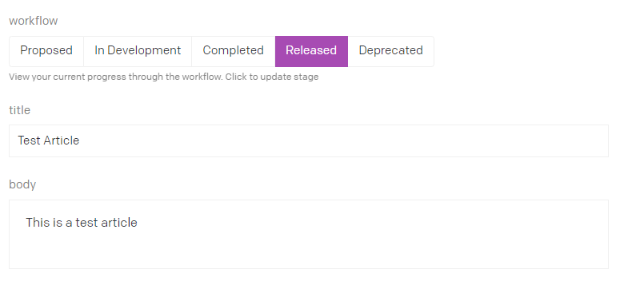
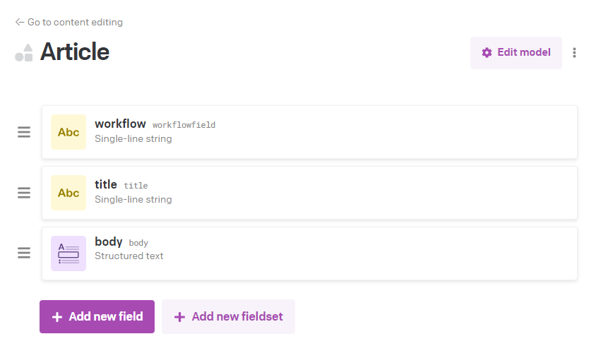
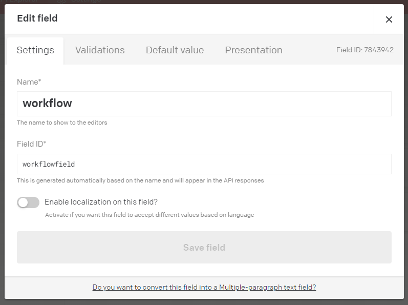

# Workflow Tracker plugin

## Note
This is still in development and has some workarounds applied (commented inline below).

## Introduction
This plugin provides a way of visualising the workflow status with a greater presence than the sidebar widget.

## Setup
To visualise the workflow associated with a record you just add a `text field` and set its id to `workflowfield`. The plugin will then automatically apply the custom editor to that field. 

If you for some reason have a field called this and don't want it to use this editor, then you'll have to fork the repo and edit the `overrideFieldExtensions` method in index.tsx.

You can name the field what ever you want to. The field ID must be `workflowfield`

(I'll see if there is an option to customise this somehow);

## Usage

Once you added the field the custom editor will then display the stages you've defined as a ButtonGroup. You can click the buttons to set the stage. When you do this, it should disable the buttons and display a spinner. It can take a couple of seconds for the update to be applied. 

## TODO
I haven't implemented any tests around permissions, so it may fail if you don't have access rules to either update the stage, or apply a specific stage. 

I'll see about adding this in. 